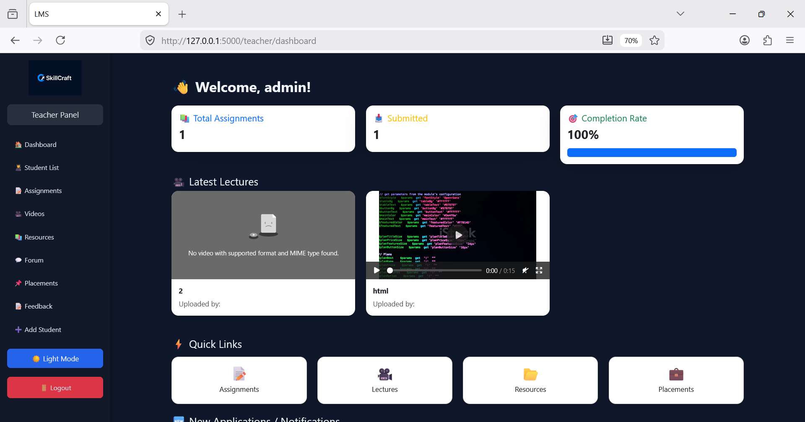
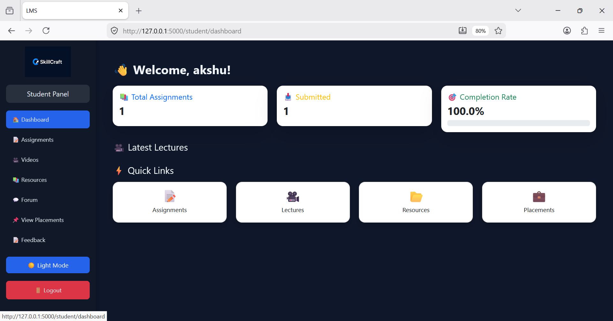
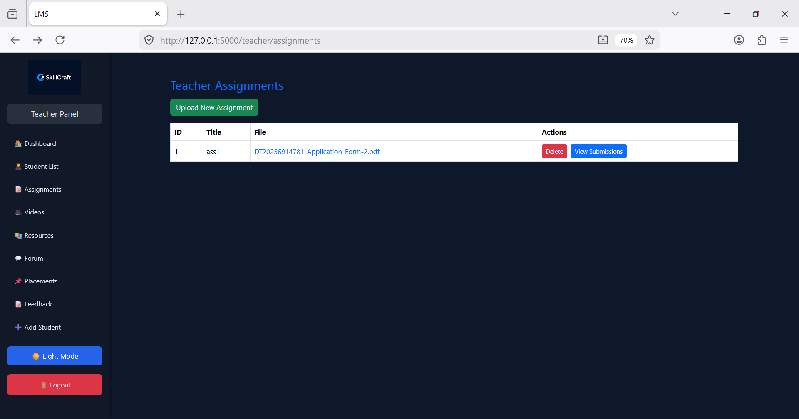
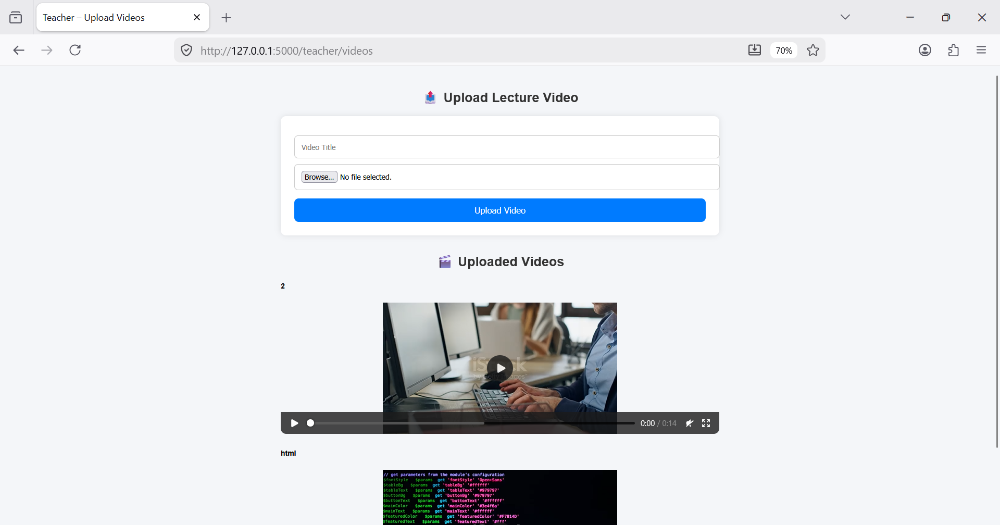
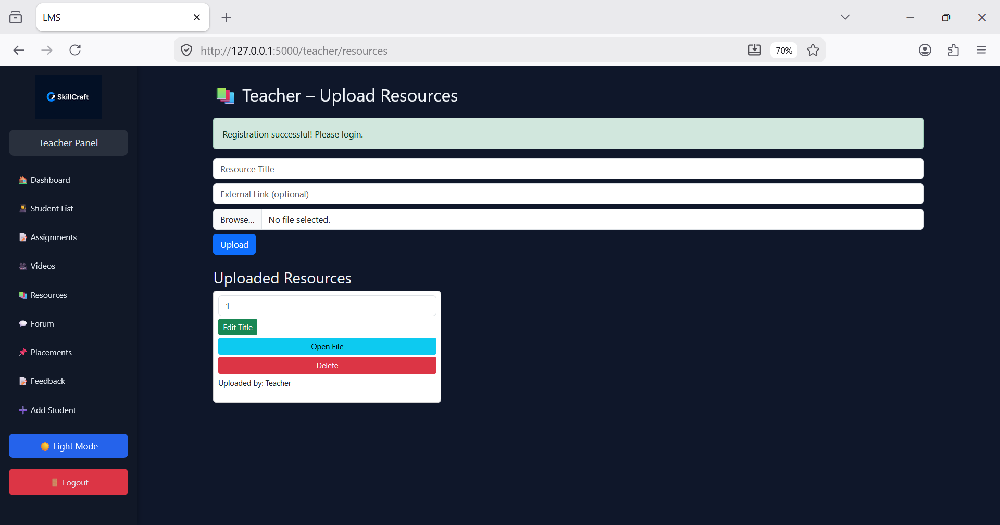
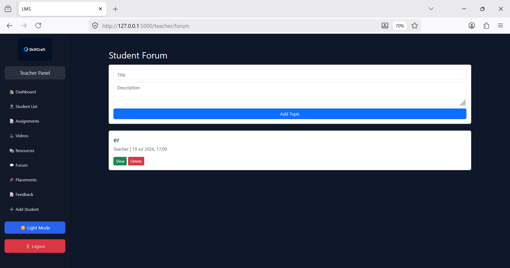
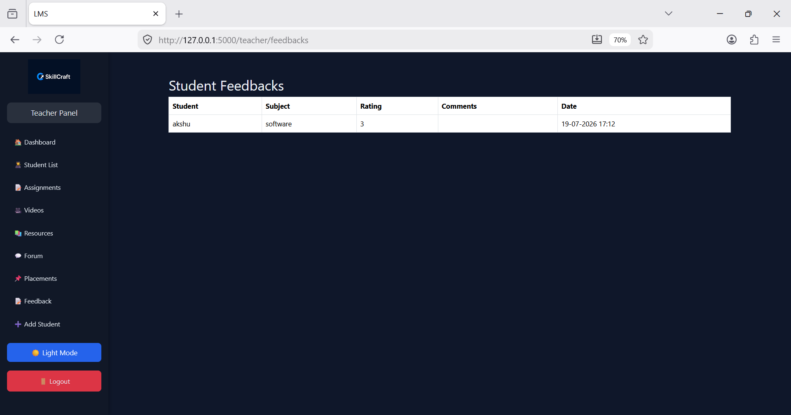

# 🎓 Learning Management System (LMS)

A role-based Learning Management System (LMS) built using **Python Flask**. The system provides separate dashboards for Teachers and Students to manage assignments, lecture videos, study resources, placements, discussion forums, and feedback efficiently.

---

## 🚀 Features

### 👨‍🏫 Teacher Module

- Secure Login & Registration
- Dashboard with Statistics
- Upload Assignments
- Upload Lecture Videos
- Upload Study Resources
- View Student Assignment Submissions
- Manage Placement Opportunities
- Discussion Forum
- View Student Feedback

### 👨‍🎓 Student Module

- Secure Login & Registration
- Personalized Dashboard
- View & Submit Assignments
- Watch Lecture Videos
- Download Study Resources
- Apply for Placements
- Participate in Discussion Forum
- Submit Feedback

---

## 🛠 Technologies Used

- Python
- Flask
- SQLAlchemy
- SQLite
- HTML5
- CSS3
- Bootstrap 5
- JavaScript
- Jinja2

---

## 📂 Project Structure

```text
LMSflaskproject/
│
├── static/
├── templates/
│   ├── student/
│   └── teacher/
├── screenshots/
├── models.py
├── lms_main.py
├── utils.py
├── requirements.txt
├── README.md
└── .gitignore
```

---

## ⚙️ Installation

### 1. Clone the repository

```bash
git clone https://github.com/Akankshawagh26/LMSflaskproject.git
```

### 2. Navigate to the project folder

```bash
cd LMSflaskproject
```

### 3. Install dependencies

```bash
pip install -r requirements.txt
```

### 4. Run the application

```bash
python lms_main.py
```

### 5. Open in your browser

```text
http://127.0.0.1:5000
```

---

## 📸 Screenshots

### 👨‍🏫 Teacher Dashboard



### 👨‍🎓 Student Dashboard



### 📝 Assignment Module



### 🎥 Lecture Videos



### 📚 Study Resources



### 💼 Placement Module


### 💬 Discussion Forum



### ⭐ Student Feedback



---

## ✨ Future Enhancements

- Email Verification
- Attendance Management
- Certificate Generation
- Admin Dashboard
- Notifications
- Chat Module
- Role-Based Access Improvements

---

## 👩‍💻 Developer

**Akanksha Sanjay Wagh**

- **GitHub:** https://github.com/Akankshawagh26
- **LinkedIn:** https://www.linkedin.com/in/akanksha-wagh111

---

## 🤝 Contributing

Contributions, suggestions, and improvements are welcome.

If you find a bug or have an idea to improve the project, feel free to open an Issue or submit a Pull Request.

---

## ⭐ Support

If you like this project, don't forget to **⭐ Star** this repository.

---

### Thank you for visiting this project! 😊